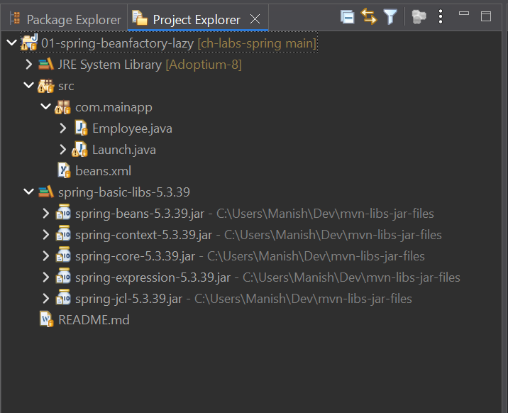

# Spring IOC Containers Bean Initialization: BeanFactory (Lazy) vs. ApplicationContext (Eager)

## Project Explorer with libraries (JARs) attached

Here is a screenshot of this Eclipse Java Project's *Project Explorer* view, in
order to cross-check & view the JARs added to the project build path:

<table align="center" border="1" cellpadding="8">
  <tr>
    <td align="center">
      
      <br />
      <em>Figure 1: Project Explorer view showing JARs required for a simple Spring Eclipse Java project</em>
    </td>
  </tr>
</table>

---

<br>

# Spring Framework IoC Containers: Core Reference Notes

## 1. Interface Hierarchy & True Inheritance
The ApplicationContext interface does not directly extend BeanFactory. Instead, it sits multiple layers deep in the interface hierarchy, inheriting from multiple specialized sub-interfaces to aggregate enterprise capabilities.

```
                         +-----------------------------------+
                         |                                   |
                         | org.springframework.beans.factory |
                         |            BeanFactory            |
                         +-----------------------------------+
                                           ^
                                           | (extends)
                 +-------------------------+-------------------------+
                 |                                                   |
                 |                                                   |
+-----------------------------------+               +-----------------------------------+
|                                   |               |                                   |
| org.springframework.beans.factory |               | org.springframework.beans.factory |
|        ListableBeanFactory        |               |     HierarchicalBeanFactory       |
+-----------------------------------+               +-----------------------------------+
                 ^                                                   ^
                 |                                                   |
                 |                                                   |
                 +-------------------------+-------------------------+
                                           | (extends multiple)
                         +-----------------------------------+
                         |                                   |
                         |  org.springframework.context.     |
                         |        ApplicationContext         |
                         +-----------------------------------+
```

* **BeanFactory**: The root interface providing fundamental bean lifecycle management and direct bean access (`getBean()`).
* **ListableBeanFactory**: Extends `BeanFactory` to allow querying and enumerating bean instances by type or name, rather than looking them up individually.
* **HierarchicalBeanFactory**: Extends `BeanFactory` to allow containers to establish parent/child relationships, allowing a bean factory to look up beans in a parent context.
* **ApplicationContext**: Inherits from `ListableBeanFactory` and `HierarchicalBeanFactory`. It also extends non-factory interfaces like `MessageSource` (for internationalization), `ApplicationEventPublisher`, and `ResourcePatternResolver` to build a complete enterprise runtime platform. [^1]

------------------------------
## 2. Low-Level Component Breakdown (The BeanFactory Eco-system)

When managing bean definitions programmatically without a full enterprise application context, Spring separates the storage of beans from the parsing of configuration files.

### DefaultListableBeanFactory

* **Role**: The core, concrete implementation of a heavy-duty engine behind Spring's bean management.
* **Functionality**: It is a full-fledged bean factory that acts as a registry for bean definitions. It stores configuration metadata internally and constructs object instances on demand.
* **Usage**: It does not know how to read files directly. It relies on external configuration readers to feed it definitions.

### XmlBeanDefinitionReader

* **Role**: The dedicated configuration parser.
* **Functionality**: It is passed a reference to a `BeanDefinitionRegistry` (like `DefaultListableBeanFactory`). It reads standard Spring XML files, parses the tags (`<bean>`), converts them into `BeanDefinition` metadata objects, and registers them into the factory.

### How they collaborate in code:

```java
// 1. Create the raw, empty container engine
DefaultListableBeanFactory registry = new DefaultListableBeanFactory();
// 2. Delegate the XML parsing duties to the reader
XmlBeanDefinitionReader reader = new XmlBeanDefinitionReader(registry);
// 3. Load and register definitions into the engine
reader.loadBeanDefinitions("beans.xml");
```

------------------------------

## 3. High-Level Container Implementations (ApplicationContext)

Modern applications utilize concrete implementations of `ApplicationContext` which automatically manage the internal factory/reader wiring behind the scenes.

```
                         +-----------------------------------+
                         |                                   |
                         |  org.springframework.context.     |
                         |        ApplicationContext         |
                         +-----------------------------------+
                                           ^
                                           | (Implemented by)
         +---------------------------------+--------------------------------------+
         |                                 |                                      |
         |                                 |                                      |
+-----------------------------------+ +-----------------------------------+ +-----------------------------------+
|                                   | |                                   | |                                   |
|   org.springframework.context.    | |   org.springframework.context.    | |   org.springframework.context.    |
|            annotation.            | |             support.              | |             support.              |
| AnnotationConfigApplicationContext| | ClassPathXmlApplicationContext    | | FileSystemXmlApplicationContext   |
+-----------------------------------+ +-----------------------------------+ +-----------------------------------+
```

### AnnotationConfigApplicationContext

* **Overview**: The modern standard container for standalone and Spring Boot application foundations.
* **Mechanics**: Accepts Java classes annotated with `@Configuration` as input. It leverages an internal component scanner to detect Spring annotations like `@Component`, `@Service`, `@Repository`, and `@Autowired`.
* **Use Case**: Production environments where programmatic Java configuration completely replaces XML. [^2] [^3]

### ClassPathXmlApplicationContext

* **Overview**: An XML-based container that looks for files inside the project's compiled build target folder (the classpath).
* **Mechanics**: Uses a `ResourceLoader` mechanism to find XML files bundled within your JAR/WAR or `src/main/resources` directories.
* **Use Case**: Standalone desktop utilities or legacy applications where infrastructure properties change without needing code re-compilation. [^4] [^5] 

### FileSystemXmlApplicationContext

* **Overview**: An XML-based container that looks for configuration metadata files outside the deployment archive.
* **Mechanics**: Bypasses the application classpath entirely to query absolute or relative physical paths on the operating system storage layer.
* **Use Case**: System deployments where system administrators must tweak configuration files located in specific server paths (e.g., `/etc/myapp/beans.xml`). [^6]

------------------------------

## 4. The XmlBeanFactory Legacy & Migration

### What was XmlBeanFactory?

`XmlBeanFactory` (belonging to the `org.springframework.beans.factory.xml` package) was a historical, concrete implementation of the `BeanFactory` interface. Its purpose was to provide a quick, lightweight container that could read bean configuration data from a standard XML resource file out of the box without needing an explicit external parser utility.

### Why was it deprecated?

`XmlBeanFactory` was officially deprecated in Spring Framework 5.3.

* **Violation of Single Responsibility**: It tightly coupled the bean registry engine logic with the specific file-parsing logic of XML schemas into a single class.
* **Redundancy**: The underlying framework had already evolved to use a highly modular design where registration and parsing are split. `XmlBeanFactory` was nothing more than a thin, unoptimized wrapper over a combination of `DefaultListableBeanFactory` and `XmlBeanDefinitionReader`. [^7]
* **Evolution of Best Practices**: Modern development shifted entirely away from raw `BeanFactory` usage in favor of `ApplicationContext` implementations, or modular programmatic setups when micro-footprints are necessary.

### The Modern Alternative and How to Use It

If you must stick to low-level, lazy-loading bean factories without the heavy feature overhead of an `ApplicationContext`, the official replacement is to explicitly pair `DefaultListableBeanFactory` with `XmlBeanDefinitionReader`.

### Migration Code Blueprint:

**Old, Deprecated Approach:**

```java
import org.springframework.core.io.ClassPathResource;
import org.springframework.beans.factory.xml.XmlBeanFactory;

// DEPRECATED - Do not use in modern projects
XmlBeanFactory factory = new XmlBeanFactory(new ClassPathResource("beans.xml"));
MyService service = factory.getBean(MyService.class);
```

**Modern, Correct Alternative:**

```java
import org.springframework.beans.factory.support.DefaultListableBeanFactory;
import org.springframework.beans.factory.xml.XmlBeanDefinitionReader;
import org.springframework.core.io.ClassPathResource;

// 1. Instantiate the modern container engine
DefaultListableBeanFactory factory = new DefaultListableBeanFactory();

// 2. Instantiate the parser, passing it the container engine registry
XmlBeanDefinitionReader reader = new XmlBeanDefinitionReader(factory);

// 3. Explicitly parse and register definitions from your target resource file
reader.loadBeanDefinitions(new ClassPathResource("beans.xml"));

// 4. Retrieve your beans safely
MyService service = factory.getBean(MyService.class);
```

------------------------------

## 5. Architectural Summary: BeanFactory vs. ApplicationContext

| Attribute | BeanFactory Layer | ApplicationContext Layer |
|---|---|---|
| Bean Instantiation | Lazy Loading: Created only when requested via code. | Eager Loading: Pre-instantiates all singletons at application startup. |
| Resource Usage | Exceptionally low footprint; ideal for constrained edge devices. | Higher memory consumption due to eager caches. |
| BPP/BFPP Discovery | Requires registering BeanPostProcessors completely manually. | Detects and registers Lifecycle processors completely automatically. |
| Enterprise Services | Lacks built-in i18n, event listeners, and AOP proxies. | Includes native AOP proxies, event publishing, and MessageSource handling. |

------------------------------

## 6. Reference Links used in this Section

[^1]: [https://rameshfadatare.medium.com](https://rameshfadatare.medium.com/spring-ioc-container-6cffd00b4b6c)
[^2]: [https://medium.com](https://medium.com/@programmingsolutions750/spring-boot-starts-here-mastering-annotations-in-the-main-class-0b6aea664354)
[^3]: [https://medium.com](https://medium.com/@pooja_virani/the-magic-of-annotations-in-spring-a14088de164a)
[^4]: [https://www.deep-kondah.com](https://www.deep-kondah.com/unpacking-the-apache-activemq-exploit-a-ransomware-delivery-deep-dive-cve-2023-46604/)
[^5]: [https://medium.com](https://medium.com/@singh.piyush/spring-6-migration-guide-replacing-xmlbeanfactory-with-classpathxml-vs-f5a276935fbf)
[^6]: [https://www.deep-kondah.com](https://www.deep-kondah.com/unpacking-the-apache-activemq-exploit-a-ransomware-delivery-deep-dive-cve-2023-46604/)
[^7]: [https://talent500.com](https://talent500.com/blog/spring-boot-4-modularization-benefits/)

<br>

---

# Experiment: Compile & Run from CLI (javac & java)

**Switch directory & create binary directory:**
```cmd
cd .\01-spring-beanfactory-lazy\

mkdir .\bytecode\
```

**Compile using javac:**

```cmd
javac -Xlint:deprecation -cp ".\src\;C:\Users\Manish\Dev\mvn-libs-jar-files\spring-beans-5.3.39.jar;C:\Users\Manish\Dev\mvn-libs-jar-files\spring-core-5.3.39.jar;C:\Users\Manish\Dev\mvn-libs-jar-files\spring-jcl-5.3.39.jar" -d .\bytecode\ -sourcepath .\src\ .\src\com\mainapp\Launch.java

:: Or in separate lines (CMD uses carot symbol ^ to break command in multiple lines):
javac ^
  -Xlint:deprecation ^
  -cp ".\src\;C:\Users\Manish\Dev\mvn-libs-jar-files\spring-beans-5.3.39.jar;C:\Users\Manish\Dev\mvn-libs-jar-files\spring-core-5.3.39.jar;C:\Users\Manish\Dev\mvn-libs-jar-files\spring-jcl-5.3.39.jar" ^
  -d .\bytecode\ ^
  -sourcepath .\src\ ^
  .\src\com\mainapp\Launch.java
```

```powershell
# In Powershell, the line break character to split command in multiple lines is backtick (`):

javac `
  -Xlint:deprecation `
  -cp ".\src\;C:\Users\Manish\Dev\mvn-libs-jar-files\spring-beans-5.3.39.jar;C:\Users\Manish\Dev\mvn-libs-jar-files\spring-core-5.3.39.jar;C:\Users\Manish\Dev\mvn-libs-jar-files\spring-jcl-5.3.39.jar" `
  -d .\bytecode\ `
  -sourcepath .\src\ `
  .\src\com\mainapp\Launch.java
```

**Copy resources (XML files):**

```powershell
Copy-Item .\src\beans.xml .\bytecode\
```

**Run the program using JVM (java):**

```cmd
java -cp ".\bytecode\;C:\Users\Manish\Dev\mvn-libs-jar-files\spring-beans-5.3.39.jar;C:\Users\Manish\Dev\mvn-libs-jar-files\spring-core-5.3.39.jar;C:\Users\Manish\Dev\mvn-libs-jar-files\spring-jcl-5.3.39.jar" com.mainapp.Launch

:: Or in separate lines (CMD uses carot symbol ^ to break command in multiple lines):
java ^
  -cp ".\bytecode\;C:\Users\Manish\Dev\mvn-libs-jar-files\spring-beans-5.3.39.jar;C:\Users\Manish\Dev\mvn-libs-jar-files\spring-core-5.3.39.jar;C:\Users\Manish\Dev\mvn-libs-jar-files\spring-jcl-5.3.39.jar" ^
  com.mainapp.Launch
```

### Peek the classpath Eclipse IDE generates when running your Java Project

- Go to top menu - "Run" -> "Run Configurations".
- "Run Configurations" dialog window opens up.
- On the left sidebar, under "Java Application", find your main class, e.g. "Launch"
  (if main class is called "Launch.java").
- Click that and in the main section of the dialog window, verify the **main class
  name**, and the **project name**.
- At the bottom, find and click the "Show Command Line" button.
- This opens a "Command Line" popup window which contains the entire JVM command
  used by Eclipse.
- Eclipse uses `javaw.exe` (Java Windowless) instead of `java.exe` in order to
  prevent the system default command prompt from opening whenever the project is
  run, and to enable Eclipse's own Console to capture the output.

Here is the command line JVM run sample command I copied from Eclipse:

```cmd
C:\Users\Manish\AppData\Local\javm\jdk\temurin@8.0.482\bin\javaw.exe ^
  -Dfile.encoding=UTF-8 ^
  -Dstdout.encoding=UTF-8 ^
  -Dstderr.encoding=UTF-8 ^
  -classpath "C:\Users\Manish\Dev\java\CodeHunt\ch-labs-spring\01-spring-beanfactory-lazy\bin;C:\Users\Manish\Dev\mvn-libs-jar-files\spring-beans-5.3.39.jar;C:\Users\Manish\Dev\mvn-libs-jar-files\spring-context-5.3.39.jar;C:\Users\Manish\Dev\mvn-libs-jar-files\spring-core-5.3.39.jar;C:\Users\Manish\Dev\mvn-libs-jar-files\spring-expression-5.3.39.jar;C:\Users\Manish\Dev\mvn-libs-jar-files\spring-jcl-5.3.39.jar" ^
  com.mainapp.Launch

:: Note: Added the line separator (^) symbols myself (Not present in Eclipse)
```

