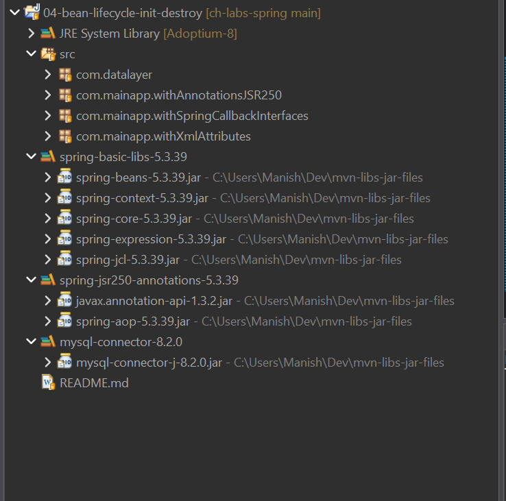

# Bean Lifecycle: Init & Destroy

- [Spring 5.3.39 &sect; 1.6. Customizing the Nature of a Bean &sect; 1.6.1. Lifecycle Callbacks](https://docs.spring.io/spring-framework/docs/5.3.39/reference/html/core.html#beans-factory-lifecycle)
- [Spring Latest &sect; Customizing the Nature of a Bean &sect; Lifecycle Callbacks](https://docs.spring.io/spring-framework/reference/core/beans/factory-nature.html#beans-factory-lifecycle)


Below are the three (3) ways for specifying bean lifecycle methods for *Initialization* and *Destruction*:

1. JSR-250 Annotations `@PostConstruct` & `@PreDestroy`
   - Use the JSR-250 `@PostConstruct` and `@PreDestroy` annotations on the
     custom setup & tear-down methods defined on your bean class.
   - Both these annotations are present in `javax.annotation` package or the `jakarta.annotation`
     package (from Jakarta EE 9).
   - Sample code in package:
     [com.mainapp.withAnnotationsJSR250](./src/com/mainapp/withAnnotationsJSR250/Launch.java)
1. XML Metadata Attributes `init-method` & `destroy-method`
   - Use the `init-method` & `destroy-method` attirbutes of `<bean />` tag in
     XML configuration metadata.
   - Specify the initialization/destruction custom method names in the bean
     class, as values for `<bean />` XML attributes `init-method` and
     `destroy-method` respectively.
   - Sample code in package:
     [com.mainapp.withXmlAttributes](./src/com/mainapp/withXmlAttributes/Launch.java)
1. Spring Callback Interfaces
   - Have your bean class implement the `InitializingBean` & `DisposableBean`
     life-cycle callback interfaces provided by Spring.
   - Both these interfaces are available in `org.springframework.beans.factory` package.
   - Sample code in package:
     [com.mainapp.withSpringCallbackInterfaces](./src/com/mainapp/withSpringCallbackInterfaces/Launch.java)


> The JSR-250 `@PostConstruct` and `@PreDestroy` annotations are generally considered best practice for receiving
> lifecycle callbacks in a modern Spring application. Using these annotations means that your beans are not coupled to
> Spring-specific interfaces.
> If you do not want to use the JSR-250 annotations but you still want to remove coupling, consider `init-method` and
> `destroy-method` bean definition XML metadata.
>
> *— Spring (Latest) Docs*

<br>

> [!NOTE]
> **Javax to Jakarta Namespace Ecosystem Progress**
> > From a namespace perspective, Jakarta EE 8 still uses the `javax.*` naming. However, the Jakarta EE 9 release on
> > Dec 8th, 2020, would introduce `jakarta.*` as the namespace to replace `javax.*` for Jakarta EE specifications.
>
> *— [jakarta.ee/blogs/javax-jakartaee-namespace-ecosystem-progress/](https://jakarta.ee/blogs/javax-jakartaee-namespace-ecosystem-progress/)*

<br>

---

# Deep Dive: Spring Bean Lifecycle Mechanics & JSR-250 Dependencies

Comprehensive self-study notes detailing the configuration, internal processing, and dependency validation required when wiring bean initialization and destruction mechanisms in a manual, non-Maven/Gradle Eclipse project running Java 8 and Spring 5.3.39.

------------------------------

## 🔍 Part 1: Correcting Java 8 Misconceptions & The Dependency Gap

### The Java 8 Package Reality (Fact Check)

Searching for a `java.xml.ws.annotation` module or package in standard Java 8 inside Eclipse using Ctrl+Shift+T will yield nothing because Java Modules (module-info) did not exist until Java 9.

In Java 8, `@PostConstruct` and `@PreDestroy` exist directly in the standard runtime library (`rt.jar`) under the package name `javax.annotation`.

### Why do we need javax.annotation-api.jar if it is already in Java 8's rt.jar?

While the project compiles fine using standard Java 8 JDK symbols, Spring 5.3.x is intentionally designed to be cross-compatible up to Java 17 and 21.

* Starting with Java 9, these annotations were moved into an isolated module (`java.xml.ws.annotation`).
* In Java 11, they were completely removed from the JDK.
* To ensure consistent behavior, decouple framework internals from shifting JDK foundations, and prevent runtime ClassNotFoundException issues when upgrading environments, modern framework development patterns expect this library to be provided explicitly as an external classpath component (`javax.annotation-api.jar`).

Below Spring Documentation pages also talks about *Using @PostConstruct and @PreDestroy*, and also where to find these annotations:

- [Spring 5.3.39 &sect; Annotation Based Container Config &sect; Using @PostConstruct and @PreDestroy](https://docs.spring.io/spring-framework/docs/5.3.39/reference/html/core.html#beans-postconstruct-and-predestroy-annotations)
- [Spring Latest &sect; Annotation Based Container Config &sect; Using @PostConstruct and @PreDestroy](https://docs.spring.io/spring-framework/reference/core/beans/annotation-config/postconstruct-and-predestroy-annotations.html)

Above articles mention how the `javax.annotation` package got removed from Java SE in JDK 11, and since Spring Framework 5 depends on theses, so
we need to get these from other sources:

> Like `@Resource`, the `@PostConstruct` and `@PreDestroy` annotation types were a part of the standard Java libraries from JDK 6 to 8.
> However, the entire `javax.annotation` package got separated from the core Java modules in JDK 9 and eventually removed in JDK 11.
> If needed, the `javax.annotation-api` artifact needs to be obtained via Maven Central now, simply to be added to the application's
> classpath like any other library.
> *— Spring 5.3.39 Docs*
>
> Like `@Resource`, the `@PostConstruct` and `@PreDestroy` annotation types were a part of the standard Java libraries from JDK 6 to 8.
> However, the entire `javax.annotation` package got separated from the core Java modules in JDK 9 and eventually removed in JDK 11.
> As of Jakarta EE 9, the package lives in `jakarta.annotation` now. If needed, the `jakarta.annotation-api` artifact needs to be
> obtained via Maven Central now, simply to be added to the application's classpath like any other library.
> *— Spring 7 (Latest) Docs*


------------------------------

## 🎯 Part 2: Exact Placement in the Bean Lifecycle

The exact point of invocation for a @PostConstruct method must be mapped accurately. It does not run "right after initialization" (which is too vague). Instead, it maps directly to the following strict timeline during context loading:

```txt
[1. Bean Instantiation] (Constructor is executed)
         👇
[2. Dependency Injection] (Setter methods / @Autowired fields are populated)
         👇
[3. @PostConstruct Execution] (Custom initialisation logic fires here)
         👇
[4. Bean is Ready for Use] (Application context fully serves the object instance)
         👇
[5. Context Shutdown / @PreDestroy] (Destruction logic executes prior to eviction)
```

A method marked with `@PostConstruct` will only run after the bean instance has been successfully instantiated in heap memory and all configuration-driven or autowired dependencies have been entirely injected into that bean instance.

------------------------------

## ⚙️ Part 3: The Engine — CommonAnnotationBeanPostProcessor

The javax.annotation-api.jar contains only passive interfaces. Annotations are simply descriptive metadata; they possess zero executable runtime logic.
The engine that actually processes these markers is `org.springframework.context.annotation.CommonAnnotationBeanPostProcessor`.

### Why It's Required

Without this class explicitly registered in the Spring container, methods tagged with @PostConstruct and @PreDestroy are completely ignored and will never execute.

### How and Why to Use It

Spring uses its internal **Aspect-Oriented Programming engine** (`spring-aop.jar`) via a programming pattern known as a Bean Post Processor.
This interceptor hooks into the lifecycle of every bean created by the container. It reflects upon the class bytecode, searches for JSR-250 annotations,
and triggers the methods manually.

If you are configured purely via a bare-bones XML setup, you must instruct Spring to register this engine. You can do this in two ways:

### Option A: Registering the processor explicitly as a standard bean

```xml
<!-- This registers the engine that scans for @PostConstruct and @PreDestroy -->
<bean class="org.springframework.context.annotation.CommonAnnotationBeanPostProcessor" />
```

### Option B: Using the shorthand context configuration namespace

```xml
<!-- Activates all common annotation post-processors, including CommonAnnotationBeanPostProcessor -->
<context:annotation-config />
```

------------------------------

## 🛠️ Part 4: Official Source Verification — Version Discovery

When working without build automation tools (like Maven or Gradle), version matching must be checked against the framework's official source code repository.

### How to Find Version Compatibility via Official Sources

To find the exact version of third-party dependencies approved by the Spring core team for Spring 5.3.39:

1. Navigate to the official GitHub repository for the project: github.com/spring-projects/spring-framework.
2. Switch the branch/tag to the specific release version tag: v5.3.39.
3. Open the main build configuration tracking directory: spring-framework-bom (Bill of Materials).
4. Inspect the core Maven Central blueprint configuration file: pom.xml.

Inside that official file, search for the javax.annotation-api entry. It reveals the exact target version compiled against the framework:

```xml
<dependency>
    <groupId>javax.annotation</groupId>
    <artifactId>javax.annotation-api</artifactId>
    <version>1.3.2</version>
</dependency>
```

Actually, this can be checked from [github.com/spring-projects/spring-framework/blob/v5.3.39/build.gradle](https://github.com/spring-projects/spring-framework/blob/v5.3.39/build.gradle) file where it says:

```groovy
configure(allprojects) { project ->
    ...

    dependencyManagement {
        imports {
            ...
        }
        dependencies {
            ...
            dependency "javax.annotation:javax.annotation-api:1.3.2"
            ...
        }
    }
}
```

<br>

> [!TIP]
> **Core Requirement:**
> The `spring-aop` companion JAR is built directly by Spring, meaning it must match
> your core framework version exactly (`5.3.39`) to prevent catastrophic binary
> incompatibilities at runtime.

### JARs required for using JSR-250 @PostConstruct & @PreDestroy annotations

1. `javax.annotation-api` version 1.3.2 (Group: `javax.annotation`)
   - Compatible with Spring Framework 5.3.39
   - mvnrepository.com Link: [javax.annotation/javax.annotation-api/1.3.2](https://mvnrepository.com/artifact/javax.annotation/javax.annotation-api/1.3.2)
1. `spring-aop` Version 5.3.39 (Group: `org.springframework`)
   - Since we're using Spring Framework 5.3.39
   - mvnrepository.com Link: [org.springframework/spring-aop/5.3.39](https://mvnrepository.com/artifact/org.springframework/spring-aop/5.3.39)

### Eclipse Project Explorer Screenshot with JARs Added

Below is screenshot of Project Explorer view of an Eclipse Java Project with the two JARs
(viz. `javax.annotation-api` and `spring-aop` JAR files) added to Project Build Path using
a new custom User Library called `spring-jsr250-annotations-5.3.39`. Check this out:

<table align="center" border="1" cellpadding="8">
  <tr>
    <td align="center">
      
      <br />
      <em>Figure 1: Project Explorer view with JARs for using JSR-250 @PostConstruct & @PreDestroy annotations</em>
    </td>
  </tr>
</table>


------------------------------

## 📑 Part 5: The Three Ways to Define Initialization & Destruction

JSR-250 annotations are not the only choice. There are three total approaches available to define custom initialization and destruction behaviors in Spring.

| Mechanism | Approach | Pros | Cons |
|---|---|---|---|
| 1. JSR-250 Annotations | Use @PostConstruct and @PreDestroy on methods. | Modern, clean, readable, standard Java convention. Using these annotations means that your beans are not coupled to Spring-specific interfaces. | Requires registration of explicit BeanPostProcessor (i.e. `CommonAnnotationBeanPostProcessor` bean) and external classpath JAR additions (i.e. `spring-aop` & `javax.annotation-api` JARs). |
| 2. XML Metadata Attributes | Define init-method and destroy-method inside the <bean/> tag. | Completely decouples Java classes from Spring/JSR dependencies. Excellent for legacy source code integration. Also great for specifying the lifecycle of a bean which is third party. If you do not want to use the JSR-250 annotations but you still want to remove coupling, consider `init-method` and `destroy-method` bean definition metadata. | String-based configuration inside configuration files; prone to typos that break only at runtime. |
| 3. Spring Callback Interfaces | Implement InitializingBean and DisposableBean interfaces. | Clear compiled contract enforcement. Run natively by container without extra reflection overhead. | Couples your domain POJO classes tightly to proprietary Spring Framework interface APIs. |

## Technical Implementation Examples

### Approach 2: Using XML Metadata Configuration

```xml
<!-- No source annotations or code modifications required inside the target class -->
<bean id="myService" 
      class="com.study.service.MyService" 
      init-method="customInit" 
      destroy-method="customCleanUp" />
```

* Why it's useful: Ideal when dealing with third-party, pre-compiled class libraries where you cannot modify the source code to drop in custom annotations.

### Approach 3: Using Spring Callback Interfaces

```java
package com.study.service;

import org.springframework.beans.factory.InitializingBean;
import org.springframework.beans.factory.DisposableBean;

public class MyService implements InitializingBean, DisposableBean {

    // Triggers exactly after instantiation and property/dependency injection
    @Override
    public void afterPropertiesSet() throws Exception {
        System.out.println("Spring Callback: Initializing bean properties...");
    }

    // Triggers exactly during application context teardown / close phases
    @Override
    public void destroy() throws Exception {
        System.out.println("Spring Callback: Disposing bean allocations...");
    }
}
```

* Why it's useful: Runs natively within the lifecycle loop of the core BeanFactory layout without requiring an extra reflection-driven annotation post-processor step.

