# Spring MVC Introduction - Dispatcher Servlet & Handler Mapping

First, we discuss the setup steps below in Eclipse for a Spring MVC project.
We will be creating a New **"Dynamic Web Project"** in Eclipse, like we used to
do when working with Servlets / JSP - Refer:
[github.com/manishbhatt94/ch-labs-servlet-jsp/blob/main/01-firstweb/README.md](https://github.com/manishbhatt94/ch-labs-servlet-jsp/blob/main/01-firstweb/README.md).

For that, we have to add a **Server** in our Eclipse workspace. We'll be using
Apache Tomcat v9.0 as the server.

Switch Eclipse to be in the "Java EE Perspective".

## Setup Apache Tomcat 9.0 on an Eclipse Workspace

> The Apache Tomcat® software is an open source implementation of the Jakarta
> Servlet, Jakarta Pages, Jakarta Expression Language, Jakarta WebSocket,
> Jakarta Annotations and Jakarta Authentication specifications. These
> specifications are part of the Jakarta EE platform.
>
> — [tomcat.apache.org/index.html](https://tomcat.apache.org/index.html)

### Download Apache Tomcat

- Navigate to [tomcat.apache.org/download-90.cgi](https://tomcat.apache.org/download-90.cgi)
- Under sections: **"9.0.121"** > **"Binary Distributions"** > **"Core"**,
  click the *link* titled **"64-bit Windows zip"**, which will download a file
  `apache-tomcat-9.0.121-windows-x64.zip` in your Downloads directory.
- Extract the zip to a convinient directory on your computer.
- Optionally rename the root folder in the zip to a better name like
  `apache-tomcat-9.0.121`.
- For example, I extracted & placed it at this path on my computer:
  `C:\Users\Manish\apache-tomcat-9.0.121\`.
- Download procedure is complete.
- Next, we need to add this server in our Eclipse Workspace.

### "Define a new server" in your Eclipse Workspace

Here we "Define a new server" in Eclipse Workspace, by specifying the type of
server (i.e. server vendor e.g. Apache's Tomcat / IBM's WebSphere / Oracle's
WebLogic / Red Hat's JBoss, and its version e.g. Tomcat v9.0 / v10.0 / etc.),
and the path on our computer where we have the corresponding server installed
i.e., the path at which we extracted the Tomcat zip in previous section.

For this, we will first add a new **"Server Runtime Environment"** from
Eclipse preferences:

- From the top menu-bar, select "Window" > "Preferences" to open the Preferences
  dialog window, and type "server" in the filter text box.
- Select "Server" > "Runtime Environments" from the filtered options, which
  shows the "Server Runtime Enviroments" section on the dialog window.
- Click "Add" button on the right side. This opens another popup called
  "New Server Runtime Enviroment". We are asked to *Select the type of runtime
  environment*.
- Expand "Apache", and select "Apache Tomcat v9.0" option under it. Then click
  the "Next" button at the bottom.
- Provide a suitable name (your choice) or keep the default pre-filled value.
- Under *Tomcat Installation Directory* field, browse and select the path at
  which we extracted & placed the Tomcat zip we downloaded (e.g. in my case,
  it is at `C:\Users\Manish\apache-tomcat-9.0.117\`).
- Under the *JRE* field dropdown, select your desired Java version. For me, I
  have configured Java 8 in Eclipse, installed using **javm**, in Eclipse
  Preferences > Installed JREs, and named it as "Adoptium-8". So I will choose
  the same option here.

**Relevant Screenshots:**

<table align="center" border="1" cellpadding="8">
  <tr>
    <td align="center">
      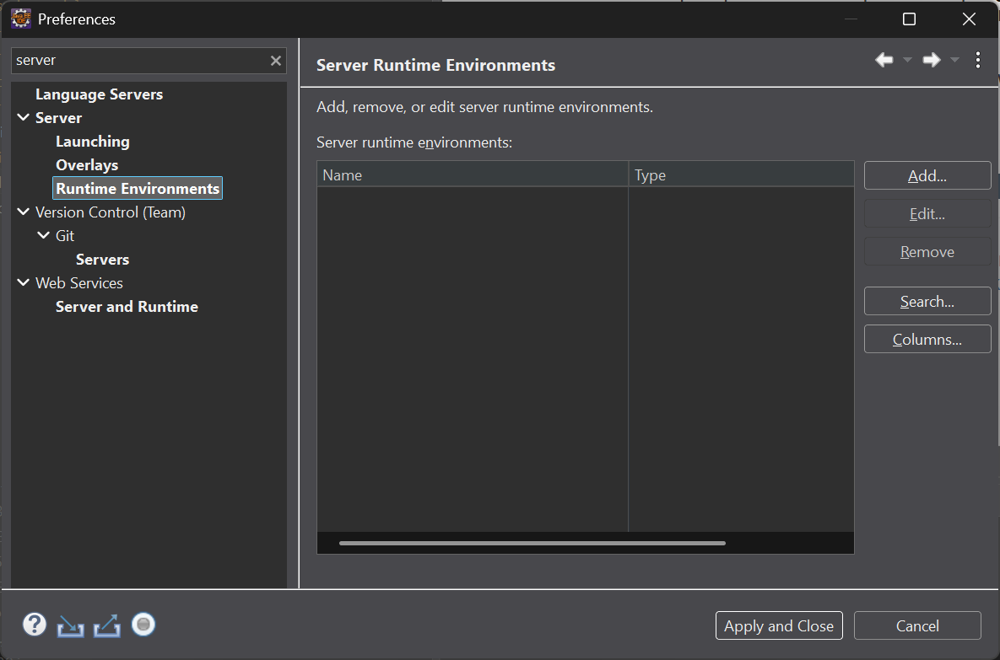
      <br />
      <em>Figure 1: Preferences: Server Runtime Environments - 1</em>
    </td>
  </tr>
  <tr>
    <td align="center">
      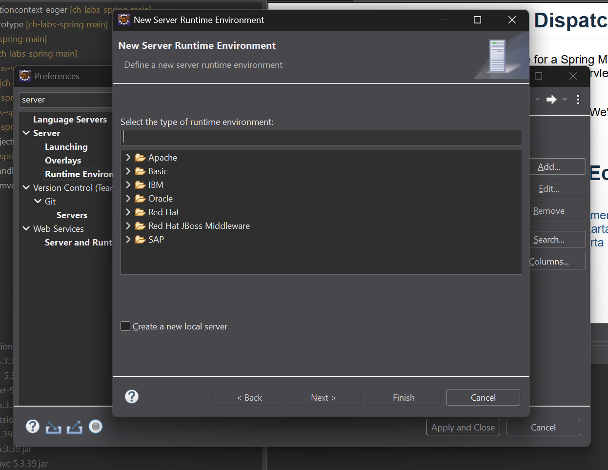
      <br />
      <em>Figure 2: Preferences: Server Runtime Environments - 2</em>
    </td>
  </tr>
  <tr>
    <td align="center">
      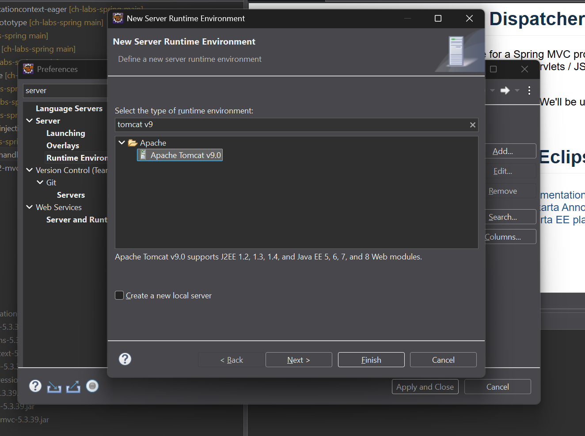
      <br />
      <em>Figure 3: Preferences: Server Runtime Environments - 3</em>
    </td>
  </tr>
  <tr>
    <td align="center">
      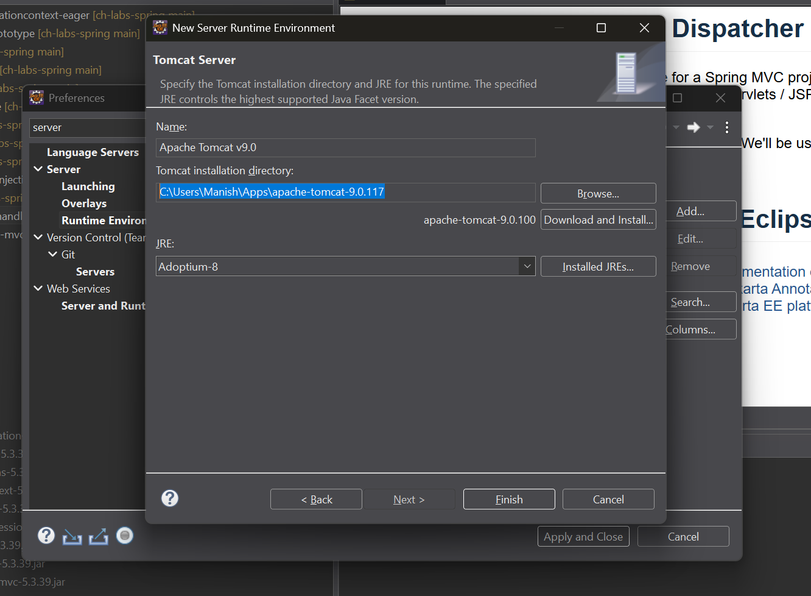
      <br />
      <em>Figure 4: Preferences: Server Runtime Environments - 4</em>
    </td>
  </tr>
  <tr>
    <td align="center">
      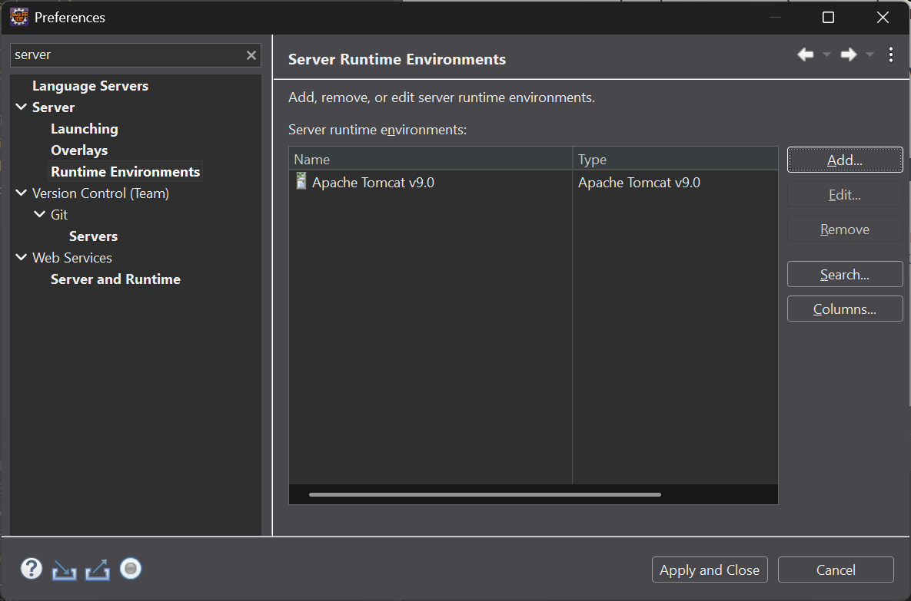
      <br />
      <em>Figure 5: Preferences: Server Runtime Environments - 5</em>
    </td>
  </tr>
</table>


<br>


Open the **"New Server"** wizard dialog window in Eclipse, by either:

- Open the **"New Wizard"** by either using the `Ctrl + N` keyboard shortcut,
  or selecting options "File" > "New" > "Other" from the top menu-bar. Then
  type "server" in the input field, and select the option "Server" > "Server"
  and hit "Next" button which opens the "New Server" wizard. **-- OR --**
- Activate the **"Servers View"** in Eclipse (similar to Console / Problems
  view). \
  Use the "Find Actions" keyboard shortcut `Ctrl + 3` and type "server" in
  its search input field, followed by selecting the option "Servers (Server)"
  under category "Views". *Or:* \
  From the top menu-bar, select options "Window" > "Show View" > "Other",
  which opens the "Show View" popup, where we type "server" in the search
  input field, and select the option "Server" > "Servers". *Or:* \
  Use the keyboard shortcut `Alt + Shift + Q, Q` which opens the "Show View"
  popup, and then find the "Servers" option. \


**Relevant Screenshots:**

<table align="center" border="1" cellpadding="8">
  <tr>
    <td align="center">
      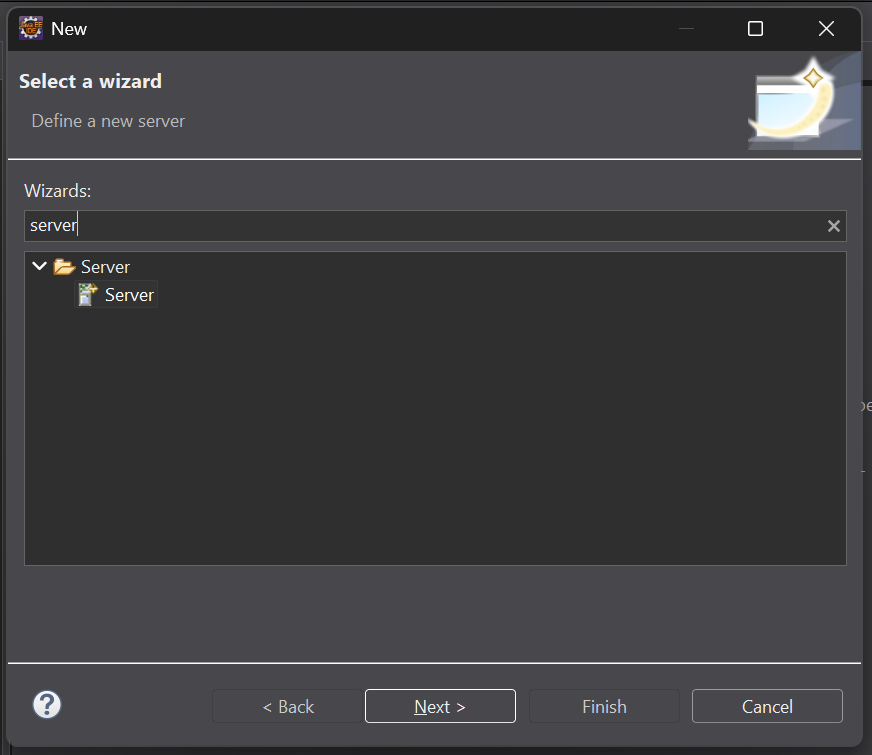
      <br />
      <em>Figure 6: New Wizard - Define a new server</em>
    </td>
  </tr>
  <tr>
    <td align="center">
      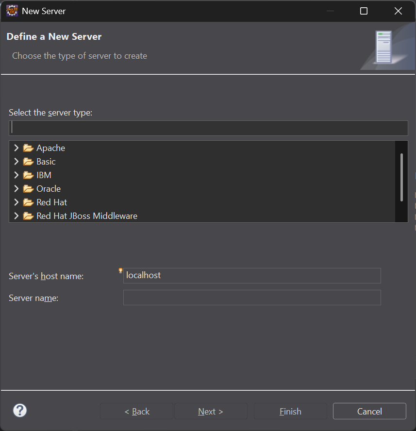
      <br />
      <em>Figure 7: New Server wizard - 1</em>
    </td>
  </tr>
  <tr>
    <td align="center">
      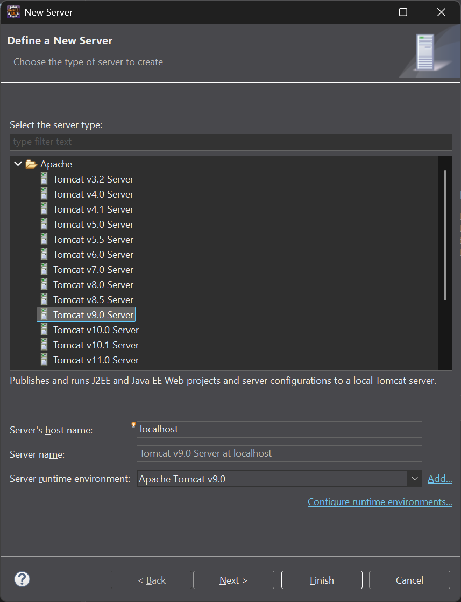
      <br />
      <em>Figure 8: New Server wizard - 2</em>
    </td>
  </tr>
  <tr>
    <td align="center">
      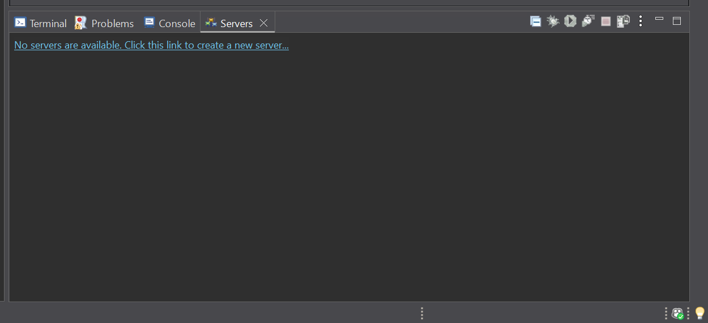
      <br />
      <em>Figure 9: Servers View (Bottom Panel) - Empty</em>
    </td>
  </tr>
</table>

<br>


## Create new Dynamic Web Project

- Keep the "Target Runtime" option set to the new server runtime you just
  added, e.g. `Apache Tomcat v9.0`.
- Choose **Version 2.3** from the "Dynamic Web Module Version" dropdown, in
  order to have support for `web.xml`.


## Add JARs to your project's "src/main/webapp/WEB-INF/lib/" directory

- For @PostConstruct / @PreDestory JSR-250 Annotations
  - `javax.annotation:javax.annotation-api:1.3.2`
  - `org.springframework:spring-aop:5.3.39`
- Spring Essential JARs (5)
  - `org.springframework:spring-beans:5.3.39`
  - `org.springframework:spring-context:5.3.39`
  - `org.springframework:spring-core:5.3.39`
  - `org.springframework:spring-expression:5.3.39`
  - `org.springframework:spring-jcl:5.3.39`


For web functionality:

- `org.springframework:spring-web:5.3.39` \
   **spring-web:** Foundational web module. It contains web-related functionality that's useful even outside of a full MVC framework. This includes:
   - Basic web application context support (`WebApplicationContext`,
   `ContextLoaderListener`) — this is what lets your Spring container start up
   inside a servlet container.
   - HTTP abstractions: `HttpMessageConverter`, multipart file upload support, HTTP client integration.
   - `RestTemplate` and low-level REST/HTTP client utilities.
   - Filters like `CharacterEncodingFilter`, `OpenSessionInViewFilter`, etc.
   - WebSocket support (in newer versions).
   - General remoting support (RMI, Hessian/Burlap in older days).

   Basically: web plumbing that any web-facing Spring app needs, whether or not you use Spring's MVC framework specifically.

- `org.springframework:spring-webmvc:5.3.39` \
   **spring-webmvc:** This is the actual MVC framework implementation. It contains:
   - `DispatcherServlet` itself.
   - The whole request-handling pipeline: `HandlerMapping`, `HandlerAdapter`,
   `HandlerExceptionResolver`.
   - Controller support (`@Controller`, `@RequestMapping`).
   - View resolution (`ViewResolver`, JSP support, etc.).
   - Form tag library, validation integration for MVC.

   `spring-webmvc` actually depends on `spring-web` — it builds on top of it.
   `DispatcherServlet` itself extends classes that ultimately rely on
   `WebApplicationContext` machinery defined in `spring-web`. So you can't
   really use `webmvc` without `web` underneath it; they're separated for
   modularity, not because they're independent alternatives.


<br>

Spring also ships `spring-webflux` (reactive alternative to `webmvc`) which
also depends on `spring-web` but not on `spring-webmvc`. That's a good way to
see the split clearly:

```txt
spring-web  (shared foundation)
   ├── spring-webmvc   (traditional servlet-based MVC)
   └── spring-webflux  (reactive, non-blocking MVC)
```


**Relevant Screenshots:**

<table align="center" border="1" cellpadding="8">
  <tr>
    <td align="center">
      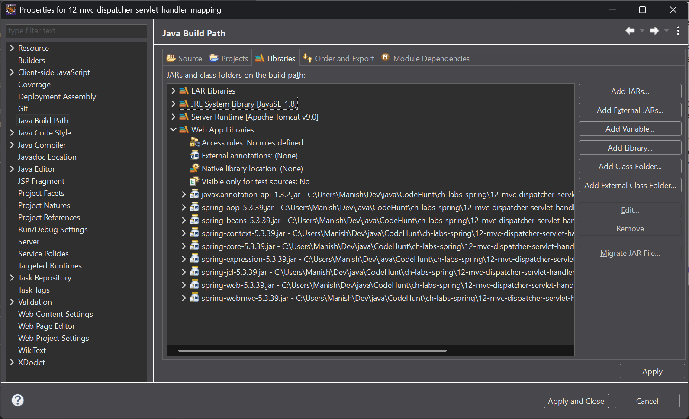
      <br />
      <em>Figure 10: Project Build Path - Libraries (JARs)</em>
    </td>
  </tr>
  <tr>
    <td align="center">
      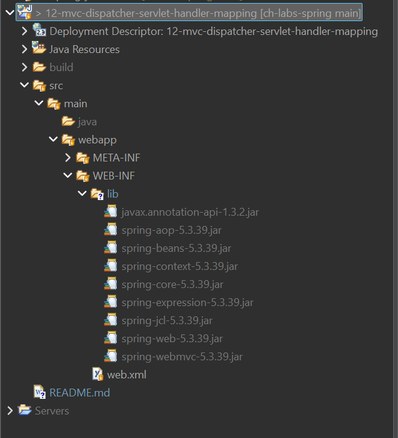
      <br />
      <em>Figure 11: Project Explorer - JARs in WEB-INF/lib/</em>
    </td>
  </tr>
  <tr>
    <td align="center">
      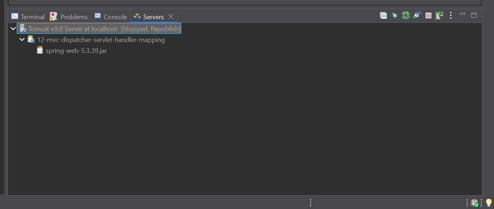
      <br />
      <em>Figure 12: Servers View (Bottom Panel) - Tomcat v9.0 Configured</em>
    </td>
  </tr>
</table>

<br>

